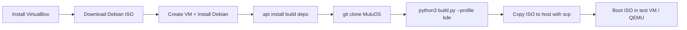

# Building & Testing MuluOS

A step-by-step guide to build MuluOS from source using Oracle VirtualBox and
Debian 12 ("Bookworm"), then test the resulting ISO in a VM.

---

## Table of Contents

1. [Prerequisites](#prerequisites)
2. [Install VirtualBox](#1-install-virtualbox)
3. [Create the Builder VM](#2-create-the-builder-vm)
4. [Install Debian](#3-install-debian)
5. [Install Build Dependencies](#4-install-build-dependencies)
6. [Clone MuluOS & Build](#5-clone-muluos--build)
7. [Test the ISO](#6-test-the-iso)
8. [Troubleshooting](#troubleshooting)

---

## Prerequisites

- Windows 10/11, macOS, or Linux host
- ~20 GB free disk space (Debian is larger than Alpine)
- Internet connection

This guide uses **VirtualBox** because it requires no special Windows features
(WSL2, Hyper‑V, Docker Desktop) and works even when the Windows component
store is corrupted. The same approach works identically on macOS and Linux hosts.

---

## 1. Install VirtualBox

1. Visit **[virtualbox.org/wiki/Downloads](https://www.virtualbox.org/wiki/Downloads)**
2. Download the installer for your host OS
   - **Windows**: `VirtualBox-7.x.x-xxxxxx-Win.exe`
   - **macOS**: `VirtualBox-7.x.x-xxxxxx-OSX.dmg`
   - **Linux**: use your distro's package manager or the `.run` installer
3. Run the installer — accept all defaults
4. Launch VirtualBox from the Start menu / Applications folder

---

## 2. Create the Builder VM

### 2.1 Download Debian

MuluOS is built on Debian 12 "Bookworm", so use the matching Debian release.

**URL**: [debian.org/download](https://www.debian.org/download)

Download the **netinst** ISO (small download, fetches packages during install):

```
https://cdimage.debian.org/debian-cd/current/amd64/iso-cd/debian-12.9.0-amd64-netinst.iso
```

> The netinst ISO is ~650 MB and downloads only the packages you select
> during installation.  If you prefer an offline installer, grab the full
> DVD ISO instead (~3.7 GB).

### 2.2 Create the Virtual Machine

| Setting | Value |
|---------|-------|
| **Name** | `MuluOS Builder` |
| **Type** | `Linux` |
| **Version** | `Debian (64-bit)` |
| **RAM** | `4096 MB` |
| **Hard disk** | `Create a virtual hard disk now` |
| **Disk size** | `20 GB` |
| **Disk type** | `VDI (VirtualBox Disk Image)` |
| **Storage** | `Dynamically allocated` |

After creating the VM, configure two extra settings:

1. **Attach the ISO**: *Settings → Storage → Optical Drive (Empty) → Choose a disk file →*
   select the `debian-12.X.0-amd64-netinst.iso` you downloaded.

2. **Network**: *Settings → Network → Adapter 1 → Attached to: NAT*.
   This gives the VM internet access through your host.

### 2.3 Start the VM

Click **Start** (green arrow). The VM boots from the Debian ISO into the
graphical installer.

---

## 3. Install Debian

### 3.1 Installer Walkthrough

The Debian installer is a guided wizard.  Accept defaults except where noted:

| Step | Choice | Notes |
|---|---|---|
| Language | English | Or your preferred language |
| Location | your country | Sets timezone + mirror |
| Keyboard | American English | Or your layout |
| Hostname | `muluos-builder` | Any name you like |
| Domain name | _(leave blank)_ | |
| Root password | _(set one)_ | Remember this! |
| Full name | `MuluOS Builder` | Display name for the user account |
| Username | `builder` | Or your preferred name |
| User password | _(set one)_ | |
| Partitioning | **Guided – use entire disk** | Select the 20 GB virtual disk |
| Partition scheme | **All files in one partition** | Simplest for a builder VM |
| Finish partitioning | **Yes** — write changes to disk | |
| Package survey | **No** | |
| Software selection | **Uncheck everything** except **SSH server** and **standard system utilities** | We install the rest manually |
| GRUB boot loader | **Yes** — install to /dev/sda | |

The installer downloads packages, installs the base system, and reboots.
This takes **10–15 minutes** depending on your internet speed.

### 3.2 First Boot

After reboot, login with the user account you created:

```
muluos-builder login: builder
Password: <the password you set>
```

Become root for the build tooling:

```bash
su -
# enter root password
```

### 3.3 Make the user a sudoer

Debian does not automatically add the first user to the `sudo` group when
a root password is set during install.  Add the builder user to `sudo` now:

```bash
# (as root)
apt install -y sudo
usermod -aG sudo builder
```

Log out and back in (or start a new login shell with `su - builder`) for
the group membership to take effect.  Verify with:

```bash
groups
# should show: builder ... sudo ...
```

---

## 4. Install Build Dependencies

Update the package index and install the tools required to build MuluOS:

```bash
apt update
apt install -y sudo git python3 python3-pip build-essential \
    squashfs-tools xorriso grub-pc-bin grub-efi-amd64-bin \
    mtools dosfstools rsync debootstrap
```

| Package | Purpose |
|---------|---------|
| `sudo` | Run commands as root |
| `git` | Clone the MuluOS repository |
| `python3` / `python3-pip` | Run `build.py` and the installer |
| `build-essential` | C compiler + make (for any kernel modules) |
| `squashfs-tools` | Create the compressed rootfs image (`mksquashfs`) |
| `xorriso` | Assemble the hybrid ISO (BIOS + EFI) |
| `grub-pc-bin` / `grub-efi-amd64-bin` | Bootloader files embedded in the ISO |
| `mtools` / `dosfstools` | FAT filesystem tools for EFI boot image |
| `rsync` | Copy files with preserved permissions |
| `debootstrap` | Bootstrap a minimal Debian rootfs from scratch |

Verify the tools are installed:

```bash
which mksquashfs xorriso grub-mkrescue python3 debootstrap
```

Each command should print a path (e.g. `/usr/bin/mksquashfs`).

---

### 4.1 Optional: Install a Desktop Environment

Running the VM with a GUI desktop makes text selection, copy/paste, and
multi‑window workflows much easier. Install KDE Plasma:

```bash
apt install -y kde-plasma-desktop plasma-workspace sddm
systemctl set-default graphical.target
reboot
```

> **Tip**: With a GUI desktop, you can enable VirtualBox clipboard sharing.
> After reboot, go to *Devices → Shared Clipboard → Bidirectional* and
> `Ctrl+C` / `Ctrl+V` work between VM and host.

---

## 5. Clone MuluOS & Build

### 5.1 Clone the Repository

```bash
cd /opt
git clone https://github.com/LeeZhiEng/MuluOS.git
cd MuluOS
```

> If you're working from a local copy on your host, use VirtualBox Shared
> Folders or SCP instead of cloning. See the **Troubleshooting** section.

### 5.2 Build the ISO

MuluOS has two profiles:

```bash
# CLI profile — server / embedded terminal-only system
python3 build.py --profile cli

# KDE Desktop profile — full KDE Plasma desktop
python3 build.py --profile kde
```

**What happens during the build** (see [`build.py`](../build.py) and
[`native.py`](../muluos/builder/native.py:9-20) for details):

1. **RootFS bootstrap** — `debootstrap` lays down a minimal Debian base, then
   `apt-get` installs the full package set (base + profile + live-only) into a
   scratch directory at `build/rootfs/`.
2. **Overlay installation** — MuluOS-specific assets (registry daemon, settings
   app, utilities) are copied over the rootfs.
3. **Chroot hook** — the script at [`scripts/chroot-hook-debian.sh`](../scripts/chroot-hook-debian.sh)
   enables systemd services, configures live‑session auto‑login, the PyQt6
   installer launcher, and system defaults.
4. **Kernel initramfs** — `update-initramfs` regenerates the initramfs with
   `live-boot` hooks so the live system can pivot from the compressed image.
5. **SquashFS** — `mksquashfs` compresses the rootfs with zstd into
   `build/iso/live/rootfs.squashfs`.
6. **ISO assembly** — `xorriso` packs the kernel, initramfs, squashfs, and GRUB
   into a hybrid ISO bootable on both BIOS and EFI systems.

**Expected output**:

```
built /opt/MuluOS/dist/muluos-0.1.0-alpha-kde-x86_64.iso
```

The ISO is approximately **1–2 GB** depending on the profile (Debian packages
are larger than Alpine's).

### 5.3 Useful Build Flags

| Flag | Effect |
|------|--------|
| `--profile cli` | Server / terminal-only profile |
| `--profile kde` | KDE Plasma desktop profile |
| `--arch x86_64` | Target architecture |
| `--output ./dist` | Where to write the ISO (default: `dist/`) |
| `--work ./build` | Scratch directory (default: `build/`) |
| `--keep-work` | Keep scratch files after build (useful for debugging) |
| `--force-native` | Require native Debian build (inside VM this is automatic) |
| `--force-docker` | Force build inside Docker even on a Debian host |

---

## 6. Test the ISO

### 6.1 Option A — Test in VirtualBox (same host)

Create a second VM to boot the MuluOS ISO:

| Setting | Value |
|---------|-------|
| **Name** | `MuluOS Test` |
| **Type** | `Linux` |
| **Version** | `Debian (64-bit)` |
| **RAM** | `4096 MB` (KDE needs at least 4 GB) |
| **Hard disk** | 16 GB (optional — boot live without installing) |
| **Optical drive** | Attach the MuluOS ISO from `dist/` |

**How to get the ISO from the builder VM to the test VM**:

1. In the *builder VM*, find its IP:
   ```bash
   ip addr show | grep 'inet '
   # Example output: inet 10.0.2.15/24
   ```

2. On your **Windows host** (PowerShell):
   ```powershell
   scp builder@10.0.2.15:/opt/MuluOS/dist/muluos-0.1.0-alpha-kde-x86_64.iso D:\Projects\MuluOS\MuluOS\dist\
   ```
   Enter the user password when prompted.

3. Attach the ISO from `D:\Projects\MuluOS\MuluOS\dist\` to the test VM's
   optical drive and boot.

### 6.2 Option B — Test with QEMU (lightweight)

Install [QEMU for Windows](https://www.qemu.org/download/#windows), then:

```powershell
qemu-system-x86_64 -m 4096 -cdrom D:\Projects\MuluOS\MuluOS\dist\muluos-0.1.0-alpha-kde-x86_64.iso -boot d
```

For EFI boot:

```powershell
qemu-system-x86_64 -m 4096 -bios OVMF.fd -cdrom D:\Projects\MuluOS\MuluOS\dist\muluos-0.1.0-alpha-kde-x86_64.iso -boot d
```

### 6.3 What to Expect on Boot

**CLI profile (`--profile cli`)**:

- Boots directly to a console login prompt
- On the live ISO, root is auto‑logged in on `tty1`
- NetworkManager and SSH are running by default
- Shell available for administration and testing

**KDE Desktop profile (`--profile kde`)**:

- The live ISO auto‑starts X.Org on `tty1` and launches the PyQt6 installer
- The installer guides you through: locale selection → disk partitioning →
  user creation → installation → summary
- After installing to the virtual disk and rebooting, KDE Plasma starts via SDDM
- Default services: NetworkManager, SSH, registry daemon

### 6.4 Live ISO GRUB Menu

When booting from the ISO, you'll see two GRUB entries:

| Entry | Description |
|-------|-------------|
| **MuluOS — Live** | Boots into the live environment with the installer |
| **MuluOS — Install** | Same as Live but auto‑launches the installer |

The kernel command‑line flag `muluos.mode=live` triggers the live‑session
behavior in [`chroot-hook-debian.sh`](../scripts/chroot-hook-debian.sh).

---

## 7. Complete Workflow Summary



**Time estimate**: 35–50 minutes from start to bootable ISO.

---

## 8. Troubleshooting

### "debootstrap: not found"

Install it on the builder host:

```bash
apt install debootstrap
```

If you're building via Docker, it's pulled automatically.

### "No build path available: not on debian and docker is missing"

You're running `build.py` on a non‑Debian host without Docker. Either:

- Install **Docker Desktop** and the build auto‑detects it, or
- Build inside a **Debian VM** as described in this guide

### VM has no internet access

Check *Settings → Network → Adapter 1 → Attached to: NAT*. Run
`dhclient` inside the VM to re‑request a DHCP lease:

```bash
sudo dhclient
```

### Out of disk space

The build needs ~5–6 GB of temporary space in `build/`. Ensure the Debian VM
disk is at least **20 GB**. Use `df -h` to check free space.

### "cannot run build.py" / "FileNotFoundError"

Ensure `python3` is installed and you're in the MuluOS directory:

```bash
cd /opt/MuluOS
python3 build.py --profile cli
```

### "No vmlinuz-* found in .../boot"

The kernel wasn't installed in the rootfs. Verify that `linux-image-amd64`
is in the base package list at [`muluos/profiles/base.py`](../muluos/profiles/base.py).

### "update-initramfs: not found"

Ensure `initramfs-tools` is in the base package list. If building manually,
install it with:

```bash
apt install initramfs-tools
```

### How to copy the ISO to the host without SCP

Use **VirtualBox Shared Folders**:

1. VM Settings → Shared Folders → Add new share
2. Folder path: `D:\Projects\MuluOS\MuluOS\dist` (Windows host)
3. Folder name: `dist`
4. Check *Auto‑mount*
5. Inside the VM:
   ```bash
   sudo adduser builder vboxsf          # one-time
   # logout/login
   cp /opt/MuluOS/dist/*.iso /media/sf_dist/
   ```
