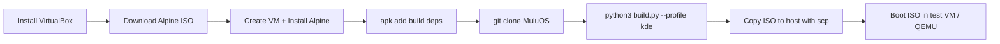

# Building & Testing MuluOS

A step-by-step guide to build MuluOS from source using Oracle VirtualBox and
Alpine Linux, then test the resulting ISO in a VM.

---

## Table of Contents

1. [Prerequisites](#prerequisites)
2. [Install VirtualBox](#1-install-virtualbox)
3. [Create the Builder VM](#2-create-the-builder-vm)
4. [Install Alpine Linux](#3-install-alpine-linux)
5. [Install Build Dependencies](#4-install-build-dependencies)
6. [Clone MuluOS & Build](#5-clone-muluos--build)
7. [Test the ISO](#6-test-the-iso)
8. [Troubleshooting](#troubleshooting)

---

## Prerequisites

- Windows 10/11, macOS, or Linux host
- ~10 GB free disk space
- Internet connection

This guide uses **VirtualBox** because it requires no special Windows features
(WSL2, Hyper‑V, Docker Desktop) and works even when the Windows component
store is corrupted. The same approach works identically on macOS and Linux hosts.

---

## 1. Install VirtualBox

1. Visit **[virtualbox.org/wiki/Downloads](https://www.virtualbox.org/wiki/Downloads)**
2. Download the installer for your host OS
   - **Windows**: `VirtualBox-7.x.x-xxxxxx-Win.exe`
   - **macOS**: `VirtualBox-7.x.x-xxxxxx-OSX.dmg`
   - **Linux**: use your distro's package manager or the `.run` installer
3. Run the installer — accept all defaults
4. Launch VirtualBox from the Start menu / Applications folder

---

## 2. Create the Builder VM

### 2.1 Download Alpine Linux

MuluOS is built on Alpine v3.21, so use the matching Alpine release.

**URL**: [alpinelinux.org/downloads](https://alpinelinux.org/downloads/)

Download the **Extended** ISO (includes extra packages useful during setup):

```
https://dl-cdn.alpinelinux.org/alpine/v3.21/releases/x86_64/alpine-extended-3.21.3-x86_64.iso
```

> **Why Extended?** It bundles the `alpine-sdk` metapackage on the ISO so you
> can install build tools without waiting for network downloads during setup.

### 2.2 Create the Virtual Machine

| Setting | Value |
|---------|-------|
| **Name** | `MuluOS Builder` |
| **Type** | `Linux` |
| **Version** | `Other Linux (64-bit)` |
| **RAM** | `2048 MB` |
| **Hard disk** | `Create a virtual hard disk now` |
| **Disk size** | `8 GB` |
| **Disk type** | `VDI (VirtualBox Disk Image)` |
| **Storage** | `Dynamically allocated` |

After creating the VM, configure two extra settings:

1. **Attach the ISO**: *Settings → Storage → Optical Drive (Empty) → Choose a disk file →*
   select the `alpine-extended-3.21.3-x86_64.iso` you downloaded.

2. **Network**: *Settings → Network → Adapter 1 → Attached to: NAT*.
   This gives the VM internet access through your host.

### 2.3 Start the VM

Click **Start** (green arrow). The VM will boot from the Alpine ISO.

---

## 3. Install Alpine Linux

### 3.1 Login

```
localhost login: root
```

There is no password on the live ISO — just press `Enter`.

### 3.2 Run the Installer

```bash
setup-alpine
```

Answer each prompt as follows:

| Prompt | Answer | Notes |
|--------|--------|-------|
| Keyboard layout | `us` | Or your locale (e.g. `gb`, `de`) |
| Variant | `us` | Press Enter for default |
| Hostname | `muluos-builder` | Any name you like |
| Network interface | `eth0` | Usually auto-detected |
| IP address | `dhcp` | Automatic IP via DHCP |
| Manual network config? | `n` | No |
| Mirror | `1` (or nearest) | `dl-cdn.alpinelinux.org` is usually fastest |
| SSH server | `openssh` | Useful for copying files out later |
| Disk | `sda` | The 8 GB virtual disk |
| How to use disk | `sys` | Full system installation (not "data" or "lvm") |
| Erase disk? | `y` | This wipes the virtual disk — it's empty, so safe |

The installer partitions the disk, formats it as ext4, and copies the base
system. This takes about **1‑2 minutes**.

### 3.3 Reboot

```bash
reboot
```

**Important**: While the VM is rebooting, go to *Settings → Storage → Optical
Drive → Remove disk from virtual drive* (or press F12 during boot and select
the hard disk). Otherwise the VM will boot from the ISO again.

After reboot, login with:

```
muluos-builder login: root
Password: <the password you set during setup-alpine>
```

---

## 4. Install Build Dependencies

Update the package index and install the tools required to build MuluOS:

```bash
apk update
apk add git python3 alpine-sdk squashfs-tools xorriso grub grub-efi mtools dosfstools rsync
```

| Package | Purpose |
|---------|---------|
| `git` | Clone the MuluOS repository |
| `python3` | Run `build.py` and the installer |
| `alpine-sdk` | C compiler + make (for kernel modules) |
| `squashfs-tools` | Create the compressed rootfs image (`mksquashfs`) |
| `xorriso` | Assemble the hybrid ISO (BIOS + EFI) |
| `grub` / `grub-efi` | Bootloader files embedded in the ISO |
| `mtools` / `dosfstools` | FAT filesystem tools for EFI boot image |
| `rsync` | Copy files with preserved permissions |

Verify the tools are installed:

```bash
which mksquashfs xorriso grub-mkrescue python3
```

Each command should print a path (e.g. `/usr/bin/mksquashfs`).

---

## 5. Clone MuluOS & Build

### 5.1 Clone the Repository

```bash
cd /opt
git clone https://github.com/LeeZhiEng/MuluOS.git
cd MuluOS
```

> If you're working from a local copy on your host, use VirtualBox Shared
> Folders or SCP instead of cloning. See the **Troubleshooting** section.

### 5.2 Build the ISO

MuluOS has two profiles:

```bash
# CLI profile — server / embedded terminal-only system
python3 build.py --profile cli

# KDE Desktop profile — full KDE Plasma desktop
python3 build.py --profile kde
```

**What happens during the build** (see [`build.py`](../build.py) and
[`native.py`](../muluos/builder/native.py:9-20) for details):

1. **RootFS bootstrap** — `apk` installs the full package set (base + profile +
   live-only) into a scratch directory at `build/rootfs/`.
2. **Overlay installation** — MuluOS-specific assets (registry daemon, settings
   app, utilities) are copied over the rootfs.
3. **Chroot hook** — the script at [`scripts/chroot-hook.sh`](../scripts/chroot-hook.sh)
   configures OpenRC services, live‑session auto‑login, the PyQt6 installer
   launcher, and system defaults.
4. **Kernel initramfs** — `mkinitfs` generates an initramfs with `squashfs` and
   `overlay` modules so the live system can pivot from the compressed image.
5. **SquashFS** — `mksquashfs` compresses the rootfs with zstd into
   `build/iso/live/rootfs.squashfs`.
6. **ISO assembly** — `xorriso` packs the kernel, initramfs, squashfs, and GRUB
   into a hybrid ISO bootable on both BIOS and EFI systems.

**Expected output**:

```
built /opt/MuluOS/dist/muluos-0.1.0-alpha-kde-x86_64.iso
```

The ISO is approximately **500 MB – 1.5 GB** depending on the profile.

### 5.3 Useful Build Flags

| Flag | Effect |
|------|--------|
| `--profile cli` | Server / terminal-only profile |
| `--profile kde` | KDE Plasma desktop profile |
| `--arch x86_64` | Target architecture |
| `--output ./dist` | Where to write the ISO (default: `dist/`) |
| `--work ./build` | Scratch directory (default: `build/`) |
| `--keep-work` | Keep scratch files after build (useful for debugging) |
| `--force-native` | Require native Alpine build (inside VM this is automatic) |

---

## 6. Test the ISO

### 6.1 Option A — Test in VirtualBox (same host)

Create a second VM to boot the MuluOS ISO:

| Setting | Value |
|---------|-------|
| **Name** | `MuluOS Test` |
| **Type** | `Linux` |
| **Version** | `Other Linux (64-bit)` |
| **RAM** | `4096 MB` (KDE needs at least 4 GB) |
| **Hard disk** | 16 GB (optional — boot live without installing) |
| **Optical drive** | Attach the MuluOS ISO from `dist/` |

**How to get the ISO from the builder VM to the test VM**:

1. In the *builder VM*, find its IP:
   ```bash
   ip addr show eth0 | grep 'inet '
   # Example output: inet 10.0.2.15/24
   ```

2. On your **Windows host** (PowerShell):
   ```powershell
   scp root@10.0.2.15:/opt/MuluOS/dist/muluos-0.1.0-alpha-kde-x86_64.iso D:\Projects\MuluOS\MuluOS\dist\
   ```
   Enter the root password when prompted.

3. Attach the ISO from `D:\Projects\MuluOS\MuluOS\dist\` to the test VM's
   optical drive and boot.

### 6.2 Option B — Test with QEMU (lightweight)

Install [QEMU for Windows](https://www.qemu.org/download/#windows), then:

```powershell
qemu-system-x86_64 -m 4096 -cdrom D:\Projects\MuluOS\MuluOS\dist\muluos-0.1.0-alpha-kde-x86_64.iso -boot d
```

For EFI boot:

```powershell
qemu-system-x86_64 -m 4096 -bios OVMF.fd -cdrom D:\Projects\MuluOS\MuluOS\dist\muluos-0.1.0-alpha-kde-x86_64.iso -boot d
```

### 6.3 What to Expect on Boot

**CLI profile (`--profile cli`)**:

- Boots directly to a console login prompt
- On the live ISO, root is auto‑logged in on `tty1`
- NetworkManager and SSH are running by default
- Shell available for administration and testing

**KDE Desktop profile (`--profile kde`)**:

- The live ISO auto‑starts X.Org on `tty1` and launches the PyQt6 installer
- The installer guides you through: locale selection → disk partitioning →
  user creation → installation → summary
- After installing to the virtual disk and rebooting, KDE Plasma starts via SDDM
- Default services: NetworkManager, SSH, registry daemon

### 6.4 Live ISO GRUB Menu

When booting from the ISO, you'll see two GRUB entries:

| Entry | Description |
|-------|-------------|
| **MuluOS — Live** | Boots into the live environment with the installer |
| **MuluOS — Install** | Same as Live but auto‑launches the installer |

The kernel command‑line flag `muluos.mode=live` triggers the live‑session
behavior in [`chroot-hook.sh`](../scripts/chroot-hook.sh:64-78).

---

## 7. Complete Workflow Summary



**Time estimate**: 25–35 minutes from start to bootable ISO.

---

## 8. Troubleshooting

### "unable to select packages busybox-initscripts"

This package was removed from Alpine v3.21. Remove it from
[`muluos/profiles/base.py`](../muluos/profiles/base.py) — the functionality is
now included in `openrc`.

### "No build path available: not on Alpine and docker is missing"

You're running `build.py` on a non‑Alpine host without Docker. Either:

- Install **Docker Desktop** and the build auto‑detects it, or
- Build inside an **Alpine VM** as described in this guide

### VM has no internet access

Check *Settings → Network → Adapter 1 → Attached to: NAT*. Run `udhcpc` inside
the VM to re‑request a DHCP lease.

### Out of disk space

The build needs ~3–4 GB of temporary space in `build/`. Ensure the Alpine VM
disk is at least **8 GB**. Use `df -h` to check free space.

### "cannot run build.py" / "FileNotFoundError"

Ensure `python3` is installed and you're in the MuluOS directory:

```bash
cd /opt/MuluOS
python3 build.py --profile cli
```

### How to copy the ISO to the host without SCP

Use **VirtualBox Shared Folders**:

1. VM Settings → Shared Folders → Add new share
2. Folder path: `D:\Projects\MuluOS\MuluOS\dist` (Windows host)
3. Folder name: `dist`
4. Check *Auto‑mount*
5. Inside the VM:
   ```bash
   adduser root vboxsf          # one-time
   reboot                        # or logout/login
   cp /opt/MuluOS/dist/*.iso /media/sf_dist/
   ```
