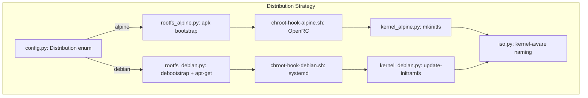

# MuluOS: Alpine → Debian Migration Plan

## Overview

MuluOS is deeply coupled to Alpine Linux at ~15 files across the build system, runtime
assets, installer, and documentation. This document provides a phase-by-phase migration
plan with concrete package mappings, code snippets, and architectural decisions.

**Target Debian version**: Debian 12 "Bookworm" (stable)

---

## Architecture Decision: Distribution Abstraction

Rather than doing a hard replace (deleting Alpine support), we introduce a thin
distribution abstraction in [`muluos/config.py`](../muluos/config.py:1) so the build
system can target either distro. This keeps Alpine as a fallback and makes future
distro additions cheaper.



The [`rootfs.py`](muluos/builder/rootfs.py:11) function becomes a dispatcher:

```python
def build(rootfs_dir, *, profile, arch, distro=Distribution.ALPINE):
    if distro == Distribution.DEBIAN:
        _build_debian(rootfs_dir, profile=profile, arch=arch)
    else:
        _build_alpine(rootfs_dir, profile=profile, arch=arch)
```

---

## Phase 1: Core Configuration (`muluos/config.py`)

**Current state** (Alpine-only constants):
```python
ALPINE_BRANCH = "v3.21"
ALPINE_MIRROR = "https://dl-cdn.alpinelinux.org/alpine"
DOCKER_IMAGE = "alpine:3.21"
```

**Target state** (distribution-aware):
```python
from enum import Enum

class Distribution(Enum):
    ALPINE = "alpine"
    DEBIAN = "debian"

# Alpine constants (keep for backward compat)
ALPINE_BRANCH = "v3.21"
ALPINE_MIRROR = "https://dl-cdn.alpinelinux.org/alpine"

# Debian constants (new)
DEBIAN_CODENAME = "bookworm"
DEBIAN_MIRROR = "http://deb.debian.org/debian"
DEBIAN_COMPONENTS = "main contrib non-free non-free-firmware"

# Docker images per distro
DOCKER_IMAGES = {
    Distribution.ALPINE: "alpine:3.21",
    Distribution.DEBIAN: "debian:bookworm-slim",
}

# Default distro for builds (change this to DEBIAN when ready)
DEFAULT_DISTRO = Distribution.DEBIAN
```

**File**: [`muluos/config.py`](muluos/config.py:1-19)

**Impact**: Low risk. Pure constant additions, no logic change. All other phases
reference these new constants.

---

## Phase 2: Package Lists — Alpine → Debian Mapping

### 2a. Base packages (`muluos/profiles/base.py`)

| # | Alpine Package | Debian Equivalent | Notes |
|---|---|---|---|
| 1 | `alpine-base` | _(minbase debootstrap)_ | Debian's `debootstrap --variant=minbase` provides base. Add `systemd-sysv` explicitly. |
| 2 | `linux-lts` | `linux-image-amd64` | Debian kernel meta-package. Also need `linux-headers-amd64` for dkms modules. |
| 3 | `linux-firmware-none` | _(omit)_ | Debian bundles firmware separately. Add `firmware-linux-free` if needed. |
| 4 | `openrc` | _(omit)_ | Debian uses systemd (pulled by `systemd-sysv`). |
| 5 | `e2fsprogs` | `e2fsprogs` | Same name. |
| 6 | `dosfstools` | `dosfstools` | Same name. |
| 7 | `btrfs-progs` | `btrfs-progs` | Same name. |
| 8 | `parted` | `parted` | Same name. |
| 9 | `sgdisk` | `gdisk` | Debian package name differs. |
| 10 | `grub` | `grub-pc-bin` | Debian splits GRUB into more granular packages. |
| 11 | `grub-efi` | `grub-efi-amd64-bin` | Architecture-specific. |
| 12 | `efibootmgr` | `efibootmgr` | Same name. |
| 13 | `python3` | `python3` | Same name. |
| 14 | `py3-pip` | `python3-pip` | Naming convention differs. |
| 15 | `networkmanager` | `network-manager` | Debian uses hyphenated name. |
| 16 | `openssh` | `openssh-server` | Debian splits client/server. |
| 17 | `sudo` | `sudo` | Same name. |
| 18 | `nano` | `nano` | Same name. |
| 19 | `tzdata` | `tzdata` | Same name. |
| 20 | `rsync` | `rsync` | Same name. |
| 21 | `lsblk` | `util-linux` | `lsblk` is part of `util-linux` in Debian. |

**New additions for Debian**:
- `systemd-sysv` — PID 1 + service manager
- `dbus` — system bus (explicit; Alpine may pull it implicitly)
- `apt` — package manager for the target system
- `initramfs-tools` — initramfs generator
- `live-boot` — live-boot scripts for Debian live ISO
- `squashfs-tools` — squashfs tools for live rootfs

**Target `base.py` for Debian**:
```python
"""Packages shared by every MuluOS profile (Debian)."""
PACKAGES = [
    # Kernel
    "linux-image-amd64",
    # Init system
    "systemd-sysv", "dbus",
    # Package management
    "apt", "apt-utils",
    # Filesystem tools
    "e2fsprogs", "dosfstools", "btrfs-progs",
    # Partitioning
    "parted", "gdisk",
    # Bootloader
    "grub-pc-bin", "grub-efi-amd64-bin", "efibootmgr",
    # Base system
    "python3", "python3-pip",
    "network-manager",
    "openssh-server",
    "sudo",
    "nano",
    "tzdata",
    "rsync",
    "util-linux",
    # Live boot support
    "live-boot", "live-boot-initramfs-tools",
    "squashfs-tools",
    # Initramfs
    "initramfs-tools",
]
```

### 2b. CLI profile (`muluos/profiles/cli.py`)

| Alpine | Debian | Notes |
|---|---|---|
| `htop` | `htop` | Same |
| `tmux` | `tmux` | Same |
| `git` | `git` | Same |
| `curl` | `curl` | Same |
| `wget` | `wget` | Same |

**No change needed** — all package names are identical.

### 2c. KDE profile (`muluos/profiles/kde.py`)

| # | Alpine | Debian | Notes |
|---|---|---|---|
| 1 | `xorg-server` | `xserver-xorg` | Meta-package in Debian. |
| 2 | `xf86-input-libinput` | `xserver-xorg-input-libinput` | Different prefix. |
| 3 | `mesa-dri-gallium` | `libgl1-mesa-dri` | Different naming. |
| 4 | `plasma-desktop` | `plasma-desktop` | Same name. |
| 5 | `plasma-workspace` | `plasma-workspace` | Same name. |
| 6 | `sddm` | `sddm` | Same name. |
| 7 | `sddm-kcm` | `sddm-kcm` | Same name (or `kde-config-sddm`). |
| 8 | `konsole` | `konsole` | Same name. |
| 9 | `dolphin` | `dolphin` | Same name. |
| 10 | `kate` | `kate` | Same name. |
| 11 | `firefox` | `firefox-esr` | Debian stable ships ESR by default. |
| 12 | `py3-qt6` | `python3-pyqt6` | Naming convention. |
| 13 | `pipewire` | `pipewire` | Same name. |
| 14 | `pipewire-pulse` | `pipewire-pulse` | Same name. |
| 15 | `wireplumber` | `wireplumber` | Same name. |
| 16 | `ttf-dejavu` | `fonts-dejavu` | Naming prefix differs. |
| 17 | `ttf-liberation` | `fonts-liberation` | Naming prefix differs. |
| 18 | `shared-mime-info` | `shared-mime-info` | Same name. |
| 19 | `desktop-file-utils` | `desktop-file-utils` | Same name. |
| 20 | `py3-pillow` | `python3-pillow` | Naming convention. |

**Target `kde.py` for Debian**:
```python
"""Desktop profile: KDE Plasma (Debian)."""
NAME = "kde"
PACKAGES = [
    # X server
    "xserver-xorg", "xserver-xorg-input-libinput",
    "libgl1-mesa-dri",
    # KDE Plasma
    "plasma-desktop", "plasma-workspace",
    "sddm", "sddm-kcm",
    "konsole", "dolphin",
    "kate",
    "firefox-esr",
    # Python Qt6 bindings
    "python3-pyqt6",
    # Audio
    "pipewire", "pipewire-pulse", "wireplumber",
    # Fonts
    "fonts-dejavu", "fonts-liberation",
    # MIME + desktop
    "shared-mime-info", "desktop-file-utils",
    # Python imaging
    "python3-pillow",
]
```

### 2d. Live packages (`muluos/builder/live.py`)

| # | Alpine | Debian | Notes |
|---|---|---|---|
| 1 | `xorg-server` | `xserver-xorg` | Same mapping as KDE. |
| 2 | `xinit` | `xinit` | Same name. |
| 3 | `xf86-input-libinput` | `xserver-xorg-input-libinput` | Same mapping. |
| 4 | `xkeyboard-config` | `xkb-data` | Debian splits keyboard config separately. |
| 5 | `setxkbmap` | `x11-xkb-utils` | Different packaging. |
| 6 | `xf86-video-vesa` | `xserver-xorg-video-vesa` | |
| 7 | `xf86-video-intel` | `xserver-xorg-video-intel` | |
| 8 | `xf86-video-amdgpu` | `xserver-xorg-video-amdgpu` | |
| 9 | `xf86-video-nouveau` | `xserver-xorg-video-nouveau` | |
| 10 | `xf86-video-vmware` | `xserver-xorg-video-vmware` | |
| 11 | `mesa-dri-gallium` | `libgl1-mesa-dri` | |
| 12 | `font-dejavu` | `fonts-dejavu` | |
| 13 | `util-linux-misc` | _(part of util-linux)_ | Already in base. |
| 14 | `xset` | `x11-xserver-utils` | Different packaging. |
| 15 | `py3-qt6` | `python3-pyqt6` | |

---

## Phase 3: RootFS Bootstrap (`muluos/builder/rootfs.py`)

**Current approach** (Alpine `apk`):
```python
subprocess.check_call([
    "apk", "--arch", arch,
    "-X", repo_main, "-X", repo_community,
    "-U", "--allow-untrusted",
    "--root", str(rootfs_dir), "--initdb",
    "add", *packages,
])
```

**Debian approach** (two-stage: `debootstrap` then `chroot apt-get`):

```python
def _build_debian(rootfs_dir, *, profile, arch):
    """Bootstrap a Debian rootfs via debootstrap + chroot apt-get."""
    rootfs_dir.mkdir(parents=True, exist_ok=True)

    # Stage 1: debootstrap minimal base
    subprocess.check_call([
        "debootstrap",
        "--arch", "amd64",
        "--variant=minbase",
        "--include=ca-certificates,apt-transport-https",
        config.DEBIAN_CODENAME,
        str(rootfs_dir),
        config.DEBIAN_MIRROR,
    ])

    # Stage 2: Write apt sources.list
    _write_apt_sources(rootfs_dir)

    # Stage 3: Install packages inside the chroot
    packages = list(base.PACKAGES) + list(profile.PACKAGES) + list(live.PACKAGES)
    _chroot_apt_install(rootfs_dir, packages)

    # Stage 4: Post-install overlays (same as Alpine path)
    _write_live_marker(rootfs_dir)
    _install_installer(rootfs_dir)
    registry.install(rootfs_dir)
    bundle.install(rootfs_dir)
    settings.install(rootfs_dir)
    utils.install(rootfs_dir)
    _run_chroot_hook(rootfs_dir, profile=profile)


def _write_apt_sources(rootfs_dir):
    sources_list = rootfs_dir / "etc" / "apt" / "sources.list"
    sources_list.parent.mkdir(parents=True, exist_ok=True)
    sources_list.write_text(
        f"deb {config.DEBIAN_MIRROR} {config.DEBIAN_CODENAME} {config.DEBIAN_COMPONENTS}\n"
        f"deb {config.DEBIAN_MIRROR} {config.DEBIAN_CODENAME}-updates {config.DEBIAN_COMPONENTS}\n"
        f"deb http://security.debian.org/debian-security {config.DEBIAN_CODENAME}-security {config.DEBIAN_COMPONENTS}\n"
    )


def _chroot_apt_install(rootfs_dir, packages):
    """Install packages inside the chroot using apt-get."""
    env = {
        "DEBIAN_FRONTEND": "noninteractive",
        "DEBCONF_NONINTERACTIVE_SEEN": "true",
        "LC_ALL": "C",
        "LANGUAGE": "C",
        "LANG": "C",
    }
    # First update
    subprocess.check_call(
        ["chroot", str(rootfs_dir), "apt-get", "update"],
        env={**os.environ, **env},
    )
    # Then install
    subprocess.check_call(
        ["chroot", str(rootfs_dir), "apt-get", "install", "-y", "--no-install-recommends", *packages],
        env={**os.environ, **env},
    )
    # Clean up to save space
    subprocess.check_call(
        ["chroot", str(rootfs_dir), "apt-get", "clean"],
    )
```

**Key differences from Alpine approach**:
1. `debootstrap` first creates the minimal Debian base (equivalent to `alpine-base`)
2. `apt-get install` inside chroot adds the full package set
3. Debian's `--no-install-recommends` flag is the closest equivalent to Alpine's lean-by-default philosophy
4. `DEBIAN_FRONTEND=noninteractive` suppresses debconf prompts during build
5. The existing overlay install functions (registry, bundle, settings, utils) remain **unchanged** — they just copy files

**File**: [`muluos/builder/rootfs.py`](muluos/builder/rootfs.py:11-69)

**⚠️ Important**: `debootstrap` must be installed on the build host. For Debian hosts it's available via `apt install debootstrap`. For the Docker path, it's available in the `debian:bookworm-slim` image. For non-Debian hosts, the Docker fallback handles it.

---

## Phase 4: Chroot Hook — OpenRC → systemd (`scripts/chroot-hook.sh`)

This is the **largest single rewrite**. The existing script is 87 lines of OpenRC-specific
service management. The Debian version must use systemd.

### Key mappings:

| Alpine (OpenRC) | Debian (systemd) |
|---|---|
| `rc-update add devfs sysinit` | _(not needed — systemd handles devtmpfs natively)_ |
| `rc-update add networkmanager default` | `systemctl enable NetworkManager` |
| `rc-update add sshd default` | `systemctl enable ssh` |
| `rc-update add muluos-registryd default` | `systemctl enable muluos-registryd` |
| `rc-update add muluos-env-generate default` | `systemctl enable muluos-env-generate` |
| `rc-update add muluos-menu-sync default` | `systemctl enable muluos-menu-sync` |
| `/etc/inittab` + `agetty --autologin` | systemd `getty@tty1.service` drop-in with `ExecStart=` override |
| `startx` from `/root/.profile` | systemd user service or `/root/.bash_profile` with `startx` |
| `echo "$PROFILE" > /etc/muluos-profile` | Same marker file approach works fine |

### Live session auto-login on Debian:

Debian's approach for auto-login on a live ISO:

```bash
# Create systemd drop-in for tty1 auto-login
mkdir -p /etc/systemd/system/getty@tty1.service.d
cat > /etc/systemd/system/getty@tty1.service.d/autologin.conf <<'EOF'
[Service]
ExecStart=
ExecStart=-/sbin/agetty --autologin root --noclear %I $TERM
EOF

# For live mode: start X automatically on tty1
cat > /root/.bash_profile <<'EOF'
if [ "$(tty)" = "/dev/tty1" ] \
   && grep -q "muluos.mode=live" /proc/cmdline 2>/dev/null \
   && [ -z "${MULUOS_X_STARTED:-}" ]; then
    export MULUOS_X_STARTED=1
    exec startx
fi
EOF

cat > /root/.xinitrc <<'EOF'
#!/bin/sh
xset s off -dpms 2>/dev/null || true
cd /opt
exec python3 -m installer.main
EOF
chmod +x /root/.xinitrc
```

### Target `chroot-hook-debian.sh`:

The full script would be ~60 lines enabling systemd services and setting up auto-login.
See the `chroot-hook-debian.sh` implementation for complete details.

**File**: `scripts/chroot-hook-debian.sh` (new file; keep `chroot-hook.sh` for Alpine)

---

## Phase 5: Init Scripts → systemd Units

### 5a. `muluos-registryd` service

**Alpine OpenRC** ([`assets/registry/etc/init.d/muluos-registryd`](assets/registry/etc/init.d/muluos-registryd:1-21)):
- Background daemon
- PID file at `/run/muluos-registryd.pid`
- Needs `/run/muluos` and `/var/lib/muluos` directories created beforehand
- Depends on `localmount`, after `bootmisc`, before `dbus` and `xdm`

**Debian systemd unit** (`assets/registry/etc/systemd/system/muluos-registryd.service`):
```ini
[Unit]
Description=MuluOS configuration registry daemon
After=local-fs.target
Before=dbus.service sddm.service

[Service]
Type=simple
ExecStart=/usr/libexec/muluos/registryd
RuntimeDirectory=muluos
StateDirectory=muluos
Restart=on-failure
RestartSec=3

[Install]
WantedBy=multi-user.target
```

### 5b. `muluos-menu-sync` service

**Alpine OpenRC** ([`assets/registry/etc/init.d/muluos-menu-sync`](assets/registry/etc/init.d/muluos-menu-sync:1-21)):
- One-shot command that runs at boot
- Needs `muluos-registryd`, before `xdm`/`sddm`

**Debian systemd unit** (`assets/registry/etc/systemd/system/muluos-menu-sync.service`):
```ini
[Unit]
Description=Regenerate KDE menu from MuluOS registry
After=muluos-registryd.service
Before=sddm.service

[Service]
Type=oneshot
ExecStart=/usr/libexec/muluos/menu-sync
RemainAfterExit=yes

[Install]
WantedBy=multi-user.target
```

### 5c. `muluos-env-generate` service

**Alpine OpenRC** ([`utils/env-editor/etc/init.d/muluos-env-generate`](utils/env-editor/etc/init.d/muluos-env-generate:1-20)):
- One-shot command
- Needs `muluos-registryd`

**Debian systemd unit** (`utils/env-editor/etc/systemd/system/muluos-env-generate.service`):
```ini
[Unit]
Description=Render /etc/profile.d/muluos-env.sh from the MuluOS registry
After=muluos-registryd.service

[Service]
Type=oneshot
ExecStart=/usr/libexec/muluos/env-generate
RemainAfterExit=yes

[Install]
WantedBy=multi-user.target
```

### 5d. Update overlay installer paths

[`muluos/builder/registry.py`](muluos/builder/registry.py:14-15) currently references:
```python
EXECUTABLE_PATHS = (
    ...
    "etc/init.d/muluos-registryd",
    "etc/init.d/muluos-menu-sync",
)
```

**Action**: Add the corresponding systemd paths (or keep init.d for Alpine and add systemd for Debian). The `install()` function should handle both:
```python
EXECUTABLE_PATHS = (
    "usr/libexec/muluos/registryd",
    "usr/libexec/muluos/menu-sync",
    "usr/bin/muluos-reg",
    "usr/bin/muluos-bundle",
    "etc/init.d/muluos-registryd",         # Alpine
    "etc/init.d/muluos-menu-sync",         # Alpine
    "etc/systemd/system/muluos-registryd.service",  # Debian
    "etc/systemd/system/muluos-menu-sync.service",  # Debian
)
```

Similarly, [`muluos/builder/utils.py`](muluos/builder/utils.py:20) has:
```python
EXECUTABLE_PARENTS = ("usr/bin", "usr/sbin", "usr/libexec/muluos", "etc/init.d")
```
Add `"etc/systemd/system"` to this tuple.

---

## Phase 6: Kernel & Initramfs (`muluos/builder/kernel.py`)

**Current** (Alpine `mkinitfs`):
```python
INITFS_FEATURES = "ata base ide scsi usb virtio ext4 squashfs overlay nvme"

def install(rootfs_dir, *, profile):
    subprocess.check_call([
        "chroot", str(rootfs_dir),
        "mkinitfs", "-F", INITFS_FEATURES,
    ])
```

**Target** (Debian `update-initramfs`):
```python
def install_debian(rootfs_dir, *, profile):
    """Rebuild initramfs inside a Debian rootfs using update-initramfs."""
    # Debian's live-boot hooks are pulled in via the live-boot-initramfs-tools
    # package. update-initramfs -u rebuilds for the currently installed kernel.
    subprocess.check_call([
        "chroot", str(rootfs_dir),
        "update-initramfs", "-u", "-k", "all",
    ])
```

**Key differences**:
- Debian's `live-boot-initramfs-tools` package (included in base packages) provides the squashfs + overlay support automatically — no need to manually specify features
- `update-initramfs -u -k all` rebuilds for all installed kernels
- Kernel naming: Debian uses versioned names (`vmlinuz-6.1.0-XX-amd64`) vs Alpine's `vmlinuz-lts`. The ISO assembly must handle this (Phase 7).

**File**: [`muluos/builder/kernel.py`](muluos/builder/kernel.py:1-15)

---

## Phase 7: ISO Assembly (`muluos/builder/iso.py`)

**Issues to address**:

### 7a. Kernel file naming

**Current** ([`muluos/builder/iso.py:72`](muluos/builder/iso.py:72)):
```python
for name in ("vmlinuz-lts", "initramfs-lts"):
```

Debian kernel files are versioned (e.g., `vmlinuz-6.1.0-25-amd64`, `initrd.img-6.1.0-25-amd64`). We need to **discover** the kernel files dynamically rather than hardcoding names:

```python
def _copy_kernel_debian(rootfs_dir, boot_dir):
    """Copy Debian kernel and initramfs to ISO staging, discovering names."""
    src_boot = rootfs_dir / "boot"
    vmlinuz = list(src_boot.glob("vmlinuz-*"))
    initrd = list(src_boot.glob("initrd.img-*"))
    if not vmlinuz or not initrd:
        raise FileNotFoundError("No kernel/initramfs found in boot/")
    # Use the first match (there's typically one kernel installed)
    shutil.copy2(vmlinuz[0], boot_dir / "vmlinuz")
    shutil.copy2(initrd[0], boot_dir / "initrd.img")
```

### 7b. GRUB configuration

**Current** ([`muluos/builder/iso.py:9-21`](muluos/builder/iso.py:9-21)):
Uses `vmlinuz-lts` and `initramfs-lts`. Also uses `root=live:LABEL=...` and `rd.live.image` which are **dracut** kernel command-line parameters (used by Alpine's mkinitfs too).

**Debian's live-boot** uses different kernel cmdline:
```
boot=live components quiet splash
```

The GRUB template needs a distro-aware variant:
```
menuentry "MuluOS {version} ({profile}) - Live" {{
    linux /boot/vmlinuz boot=live components quiet splash muluos.mode=live
    initrd /boot/initrd.img
}}
```

> **⚠️ Decision point**: Debian's live-boot package may use `boot=live` vs Alpine's `root=live:LABEL=...`. The exact cmdline depends on whether we use Debian's `live-boot` package or roll our own live scripts. Using `live-boot` is recommended since it's battle-tested and pulls in `live-boot-initramfs-tools` for initramfs integration.

**File**: [`muluos/builder/iso.py`](muluos/builder/iso.py:1-188)

---

## Phase 8: Docker Build Path (`muluos/builder/docker.py`)

**Current**:
```python
BUILD_DEPS = (
    "python3 py3-pip alpine-sdk apk-tools "
    "squashfs-tools xorriso grub grub-efi mtools dosfstools rsync"
)

inner = (
    f"apk add --no-cache {BUILD_DEPS} && "
    f"python3 build.py ..."
)

config.DOCKER_IMAGE  # "alpine:3.21"
```

**Target** (Debian Docker image):
```python
DEBIAN_BUILD_DEPS = (
    "python3 python3-pip build-essential "
    "squashfs-tools xorriso grub-pc-bin grub-efi-amd64-bin "
    "mtools dosfstools rsync debootstrap"
)

def run_debian(*, profile, arch, output_dir, work_dir, keep_work):
    inner = (
        f"apt-get update && "
        f"apt-get install -y --no-install-recommends {DEBIAN_BUILD_DEPS} && "
        f"python3 build.py --profile {profile.NAME} --arch {arch} "
        f"--work /work --output /dist --force-native"
        f"{' --keep-work' if keep_work else ''}"
    )
    cmd = [
        "docker", "run", "--rm", "--privileged",
        "-v", f"{config.REPO_ROOT}:/src",
        "-v", f"{work_dir}:/work",
        "-v", f"{output_dir}:/dist",
        "-w", "/src",
        config.DOCKER_IMAGES[Distribution.DEBIAN],
        "sh", "-c", inner,
    ]
    return subprocess.call(cmd)
```

**Key changes**:
- Docker base image: `alpine:3.21` → `debian:bookworm-slim`
- `apk add` → `apt-get install`
- `alpine-sdk` → `build-essential`
- `apk-tools` → not needed (apt is already in the Debian image)
- Added `debootstrap` to build deps

**File**: [`muluos/builder/docker.py`](muluos/builder/docker.py:1-32)

---

## Phase 9: Host Detection (`muluos/builder/host.py`)

**Current**: Only detects Alpine.
```python
def is_alpine_host() -> bool:
    return "ID=alpine" in Path("/etc/os-release").read_text()
```

**Target**: Detect both Alpine and Debian:
```python
def detect_distro() -> Distribution | None:
    """Return the host distribution or None if unrecognized."""
    os_release = Path("/etc/os-release")
    if not os_release.exists():
        return None
    content = os_release.read_text()
    if "ID=alpine" in content:
        return Distribution.ALPINE
    if "ID=debian" in content:
        return Distribution.DEBIAN
    # Also check ID_LIKE for Debian derivatives (Ubuntu, etc.)
    if "ID_LIKE=debian" in content:
        return Distribution.DEBIAN
    return None


def select_runner(*, force_docker=False, force_native=False, distro=None):
    """Pick a build runner based on host environment and target distro."""
    if force_docker and force_native:
        raise SystemExit("--force-docker and --force-native are mutually exclusive")
    if distro is None:
        distro = config.DEFAULT_DISTRO

    if force_native:
        host_distro = detect_distro()
        if host_distro != distro:
            raise SystemExit(
                f"--force-native requires a {distro.value} host "
                f"(detected {host_distro.value if host_distro else 'unknown'})"
            )
        return native
    if force_docker:
        if not has_docker():
            raise SystemExit("--force-docker but docker is not on PATH")
        return docker

    # Auto-detect: prefer native if host matches target distro
    host_distro = detect_distro()
    if host_distro == distro:
        return native
    if has_docker():
        return docker
    raise SystemExit(
        "No build path available. "
        "Install Docker, or run on a matching distribution host."
    )
```

**File**: [`muluos/builder/host.py`](muluos/builder/host.py:1-38)

---

## Phase 10: Installer (`muluos/installer/backend/install.py`)

Three Alpine-specific calls need updating:

### 10a. Live package pruning
**Current** ([`muluos/installer/backend/install.py:47-50`](muluos/installer/backend/install.py:47-50)):
```python
subprocess.run(
    ["chroot", str(TARGET), "apk", "del", *packages],
    check=False,
)
```
**Debian**:
```python
subprocess.run(
    ["chroot", str(TARGET), "apt-get", "purge", "-y", *packages],
    check=False,
)
# Also run autoremove to clean orphans
subprocess.run(
    ["chroot", str(TARGET), "apt-get", "autopurge", "-y"],
    check=False,
)
```

### 10b. Service enablement
**Current** ([`muluos/installer/backend/install.py:60-62`](muluos/installer/backend/install.py:60-62)):
```python
for svc in ("dbus", "sddm", "muluos-menu-sync"):
    subprocess.check_call([
        "chroot", str(TARGET), "rc-update", "add", svc, "default",
    ])
```
**Debian**:
```python
for unit in ("dbus", "sddm", "muluos-menu-sync"):
    subprocess.check_call([
        "chroot", str(TARGET), "systemctl", "enable", unit,
    ])
```

### 10c. User creation
**Current** ([`muluos/installer/backend/install.py:77-80`](muluos/installer/backend/install.py:77-80)):
```python
subprocess.check_call([
    "chroot", str(TARGET),
    "adduser", "-D", "-G", "wheel", "-s", "/bin/sh", username,
])
```
Alpine's `adduser -D` creates a system user with defaults. Debian's `adduser` has different flags:
```python
subprocess.check_call([
    "chroot", str(TARGET),
    "useradd", "-m", "-G", "wheel,sudo", "-s", "/bin/bash", username,
])
```
Note: Debian uses `useradd` (lower-level) with `-m` to create home directory, and typically uses `sudo` group in addition to `wheel`. Also, Debian's default shell is `/bin/bash` (not `/bin/sh`, which is `dash`).

**File**: [`muluos/installer/backend/install.py`](muluos/installer/backend/install.py:1-86)

---

## Phase 11: Documentation (`docs/building-and-testing.md`)

The existing guide is a complete Alpine installation walkthrough. The Debian version needs:

1. **Builder VM creation**: Use Debian 12 netinst ISO instead of Alpine
   - Download: `https://cdimage.debian.org/debian-cd/current/amd64/iso-cd/debian-12.X.0-amd64-netinst.iso`
   - VirtualBox settings: same as before but recommend 4096 MB RAM + 16 GB disk (Debian is larger)
2. **Installation steps**: Replace `setup-alpine` with Debian installer walkthrough
3. **Build dependencies**: Replace `apk add ...` with `apt install ...`
4. **Desktop environment**: Replace `setup-desktop` with `tasksel` or manual `apt install kde-plasma-desktop`
5. **Troubleshooting**: Update all error messages and package references

**File**: [`docs/building-and-testing.md`](docs/building-and-testing.md:1-414)

---

## Phase 12: Integration Testing

**Test plan**:

1. **Smoke test**: `python3 build.py --profile cli` on a Debian host → verify ISO is produced
2. **KDE test**: `python3 build.py --profile kde` → verify ISO boots to KDE Plasma in QEMU/VirtualBox
3. **Docker test**: `python3 build.py --profile kde --force-docker` → verify Docker path works
4. **Installer test**: Boot live ISO and run through installer → verify installed system boots
5. **Service test**: Verify `muluos-registryd`, `muluos-menu-sync`, `muluos-env-generate` are active after install
6. **Live pruning test**: CLI install removes live packages; KDE install keeps them

---

## File Change Summary

| # | File | Change Type | Effort |
|---|---|---|---|
| 1 | [`muluos/config.py`](muluos/config.py:1-19) | Add constants | Small |
| 2 | [`muluos/profiles/base.py`](muluos/profiles/base.py:2-18) | Rewrite package list | Medium |
| 3 | [`muluos/profiles/cli.py`](muluos/profiles/cli.py:2-9) | No change | None |
| 4 | [`muluos/profiles/kde.py`](muluos/profiles/kde.py:2-15) | Rewrite package list | Medium |
| 5 | [`muluos/builder/live.py`](muluos/builder/live.py:1-35) | Rewrite package list | Medium |
| 6 | [`muluos/builder/rootfs.py`](muluos/builder/rootfs.py:11-69) | Major rewrite | High |
| 7 | [`muluos/builder/kernel.py`](muluos/builder/kernel.py:1-15) | Rewrite | Medium |
| 8 | [`muluos/builder/iso.py`](muluos/builder/iso.py:1-188) | Modify kernel naming + GRUB | Medium |
| 9 | [`muluos/builder/docker.py`](muluos/builder/docker.py:1-32) | Rewrite | Medium |
| 10 | [`muluos/builder/host.py`](muluos/builder/host.py:1-38) | Rewrite | Medium |
| 11 | [`muluos/builder/registry.py`](muluos/builder/registry.py:14-15) | Add systemd paths | Tiny |
| 12 | [`muluos/builder/utils.py`](muluos/builder/utils.py:20) | Add systemd path | Tiny |
| 13 | [`scripts/chroot-hook.sh`](scripts/chroot-hook.sh:1-87) → new `scripts/chroot-hook-debian.sh` | Complete rewrite | High |
| 14 | New: `assets/registry/etc/systemd/system/muluos-registryd.service` | New file | Small |
| 15 | New: `assets/registry/etc/systemd/system/muluos-menu-sync.service` | New file | Small |
| 16 | New: `utils/env-editor/etc/systemd/system/muluos-env-generate.service` | New file | Small |
| 17 | [`muluos/installer/backend/install.py`](muluos/installer/backend/install.py:1-86) | Modify 3 functions | Medium |
| 18 | [`docs/building-and-testing.md`](docs/building-and-testing.md:1-414) | Rewrite | Medium |
| 19 | [`build.py`](build.py:1-55) | Add `--distro` flag | Small |

**Total**: 19 files touched, 5 new files created, 3 complete rewrites, ~10 medium-effort changes, ~4 small changes.

---

## Execution Order (Recommended)

1. **Phase 1** — Config constants (no risk, enables everything else)
2. **Phase 2** — Package lists (can be tested in isolation)
3. **Phase 5** — Systemd units (standalone; can be done in parallel with Phase 2-3)
4. **Phase 3** — RootFS bootstrap (core build pipeline)
5. **Phase 6** — Kernel initramfs (depends on Phase 3)
6. **Phase 7** — ISO assembly (depends on Phase 6)
7. **Phase 4** — Chroot hook (depends on Phase 3 + 5)
8. **Phase 10** — Installer (depends on Phase 4)
9. **Phase 8** — Docker path (depends on Phase 3-7)
10. **Phase 9** — Host detection (depends on Phase 8)
11. **Phase 11** — Documentation (last; documents the final state)
12. **Phase 12** — Integration testing (validates all phases)
